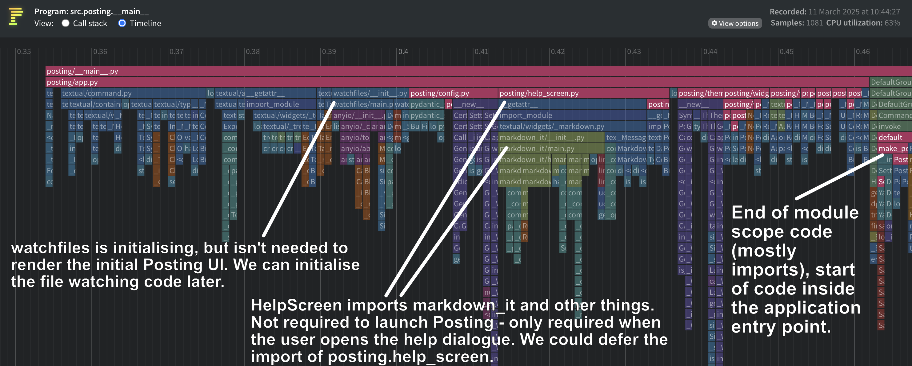
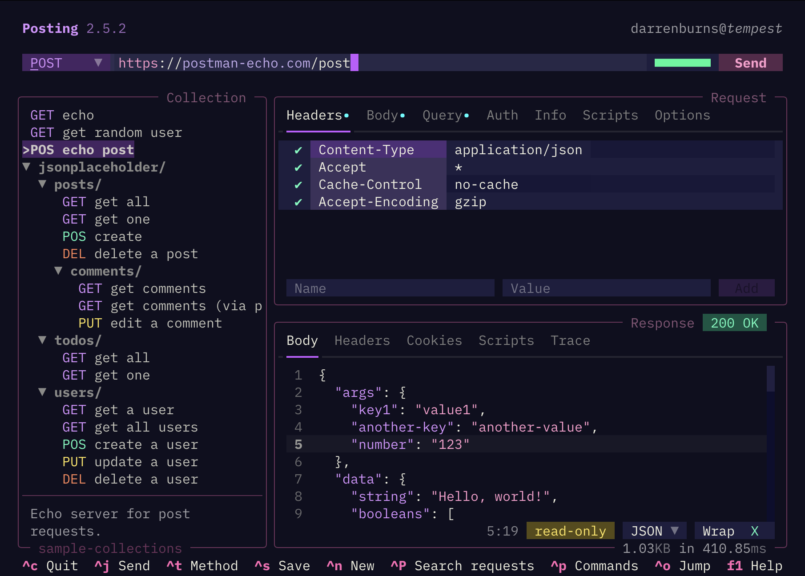

+++
title = "Improving Posting's startup time by over 60%"
date = 2025-03-13T10:09:06Z
draft = false
author = "Darren Burns"
tags = ['python', 'posting', 'performance', 'textual', 'cli']
+++

I've been working on improving the startup time of Posting recently.
[Posting](https://github.com/darrenburns/posting) is a TUI application built with [Textual](https://textual.textualize.io/), and written in Python, for managing and sending HTTP requests.



This post is an overview of some of the techniques (and hacks) I used and the gains made, including:

- Using `python -X importtime` to measure import times.
- Reducing the scope of import statements, so that they don't run when they're not needed.
- Patching dependencies to prune the import tree.
- Using `pyinstrument` and it's new flamegraph view to find improvements.
- Extracting expensive-to-import classes into their own modules, isolating other code from them.
- Lazy loading of Textual widgets.
- Using C-based extensions where possible.

Most of the techniques are Python-specific, and almost all of them boil down to deferring work until it's actually required.

The values in this post are measured on an M4 Macbook Pro - the absolute gains on slower systems will likely be greater.

## Deferring openapi_pydantic import (~63ms gained)

If you run a Python application with `python -X importtime`, Python will print a table showing how long it takes to import each module. The "imported package" column contains the name of the module being imported, and if you look at the indentation of it, you'll see it forms a tree structure.

The table is best read bottom-up, because parent modules are listed below child modules. The `cumulative` column contains the time, in microseconds, to import the module in it's entirety, including all descendent imports.

```bash
import time: self [us] | cumulative | imported package
  ... trimmed ...
import time:      3505 |      29292 |         openapi_pydantic.v3.v3_1
import time:      4138 |      62771 |       openapi_pydantic.v3.parser
import time:        84 |      62854 |     openapi_pydantic.v3
import time:        99 |      62952 |   openapi_pydantic
import time:        97 |      63048 | posting.importing.open_api
```

The table above shows that `posting.importing.open_api` and it's descendants take a total of 63ms to import. However, this part of Posting is specific to a single CLI command, `posting import`, which is not used as part of the main TUI. By moving this import into the local scope of the import command handler, we can ensure we only pay the price when the `posting import` runs.


@cli.command(name="import")
# ...
def import_spec(spec_path: str, output: str | None) -> None:
    """Import an OpenAPI specification into a Posting collection."""
    # ...
    from posting.importing.open_api import import_openapi_spec
    # ...


 The difference was immediately noticeable to me, and startup time measurement code in Posting reported a 63ms improvement. Simply by moving a single import statement. Nice!

In Python CLI apps, it's common to have multiple command handlers in one file, with dependencies imported at the module level, even when they're only needed by specific handlers. This is like importing the whole world when you only need an island. By moving imports inside the handlers, we can avoid this, loading just what's necessary for the executed command.

## Patching httpx  (20-25ms gained)

I found that the fantastic [`httpx` module](https://www.python-httpx.org/) was taking around 51 milliseconds to import, which felt excessive. Almost 30 milliseconds of that was `httpx._main`, which contains a CLI tool for `httpx`. On diving into that module's code, I found that if your environment contains `click` and `rich` (both common libraries), `httpx` "assumes", that you've installed the `httpx[cli]` extras and will perform a bunch of expensive imports that are required for the `httpx` CLI. End-user apps are unlikely to require CLI, but will still pay a ~30ms price to import it.

```bash
import time: self [us] | cumulative | imported package
  ... trimmed ...
import time:       292 |      28409 |       httpx._main
import time:       195 |      51101 |     httpx
```

To avoid running through this expensive and unnecessary import chain, I manually patch the `httpx._main` module at runtime, before importing `httpx` itself:

```python
import sys
sys.modules['httpx._main'] = None

# later...
import httpx
```

Checking the import times again, I found the cumulative time for `httpx` dropped from 51ms to 23ms:

```bash
import time: self [us] | cumulative | imported package
  ... trimmed ...
import time:         2 |          2 |       httpx._main
import time:       156 |      23305 |     httpx
```

About 28ms saved. Not bad!

Modules are cached once loaded, so some of the modules that were imported transitively by `httpx._main` and *actually* required somewhere in Posting will be still be loaded elsewhere. This means a portion of these savings are likely just due to the import cost being shifted elsewhere. However, many expensive imports such as `pygments` that were required by `httpx._main` and *not* required by Posting have been eliminated.

I feel I should emphasise that this is a *hack* - and if you're going to do it you should be comfortable that the module is truly unused.

All of this makes me wish Python had a means of checking *which* extras were explicitly installed by the user or application. This would allow `httpx` to only perform those expensive imports when they're asked for rather than if they happen to be installed in the environment.


## Using pyinstrument's flamegraph view

[`pyinstrument`](https://github.com/joerick/pyinstrument) is one of my favourite tools, ever. It's a sampling profiler, which recently added a flamegraph viewer.

On running the command below, Posting starts up, and when I close the app, `pyinstrument` will open a browser window with profiling results.

```bash
pyinstrument -r html -m src.posting.__main__
```

A couple of things stood out when I examined the flamegraph tab:



- `watchfiles` is being initialised before the app starts, but we don't actually need to setup file watchers until after the app has started.
- `help_screen` is being imported before the app starts, which is ultimately importing `markdown_it`. We don't actually need the Markdown rendering stuff until the user opens the help popup - so we don't need to pay the import cost until then.

I made a couple of changes, noted below, based on these findings.
It sliced another ~16ms off of the startup time.
Not amazing, but small improvements like this add up!

### Moving HelpData class to its own module (10ms gained)

If you have code which is required on startup which is currently housed in a module alongside expensive-to-import and *not* required on startup code, you can extract the code that is required on startup into its own module and defer the expensive imports into the local scope(s) where it's required.

In other words, try to isolate expensive-to-import code by splitting it into a separate module, so that it can be imported on its own, and won't get pulled in alongside cheaper to import code.

In Posting, the `HelpData` class was contained alongside the `HelpScreen` class. `HelpData` is required on startup and, on it's own, would be cheap to import. However, because it's bundled into the same module as `HelpScreen`, importing `HelpData` also imports all the dependencies of `HelpScreen`.

I extracted `HelpData` into a separate `help_data` module, meaning it could be imported at the module level without the overhead of also importing all of the other stuff housed alongside `HelpScreen`. `HelpScreen` is now imported "on demand", when the user opens the help popup.

This change shaved another 10ms off of the startup time.

### Deferred loading of watchfiles library (6ms gained)
Posting watches for changes to external files using `watchfiles`. The watching happens in another `asyncio.Task`, so by moving the import into the task which isn't kicked off until the app starts, Posting started ~6ms faster on my machine.

## Using Textual's Lazy widget for tab panes (100ms gained)
Posting's user interface relies heavily on tabs to hide content. By default, Textual will load the content of all tabs before on startup, even though only two tabs can be visible and interactive.



I used Textual's `Lazy` widget to defer loading of the hidden content of these tabs until after the initial paint, and this had a substantial impact on the time taken to first paint.

My approach to testing this is rather primitive and slightly flawed, but good enough.
I record a video using Quicktime Player, and scrub through it - taking note of the timestamp at which I pressed `Enter` to run Posting (Launch time (s)), and the time at which the UI is first painted (First paint time (s)). The difference between these timestamps is the Time To First Paint (TTFP (ms)).
This allows me to measure the full end-to-end time from when I press `Enter` to when the UI is first painted.

### Without Lazy (before)

| Run | Launch (s) | First paint (s) | TTFP (ms) |
|:----|-----------------|----------------------|-----------|
| 1   | 2.48            | 2.98                 | 500       |
| 2   | 4.37            | 4.86                 | 490       |
| 3   | 6.88            | 7.38                 | 500       |
| 4   | 10.17           | 10.65                | 480       |

### With Lazy (after)

| Run | Launch (s) | First paint (s) | TTFP (ms) |
|:----|-----------------|----------------------|-----------|
| 1   | 17.58           | 17.98                | 400       |
| 2   | 19.62           | 20.00                | 380       |
| 3   | 21.50           | 21.87                | 370       |
| 4   | 23.55           | 23.92                | 370       |

This approach is quite time consuming, and it's not particularly accurate, since QuickTime records at 60fps (each frame captures ~17ms of time). However, in this case I didn't require a high degree of accuracy in order to determine the magnitude of improvement.

## Using PyYAML's CLoader (5ms gained)
Posting uses PyYAML to parse request files and theme files. Requests are stored in YAML files on disk, and when you load a collection into Posting, it'll load all of the request YAML files into memory.

PyYAML has a C implementation, which can be used if `libyaml` is available on the host system.

```python
import yaml
data = yaml.load(file, Loader=yaml.CLoader)
```

Switching to this load time when loading a collection of 18 requests from 72ms to 67ms. The time taken loading and parsing the YAML files specifically reduced from 8ms to 3ms.

## Final results

I re-ran the test where I record a video and examine the timestamps where I run the command vs when the UI is first painted. This time, a collection of 18 requests was loaded into the app on startup as well as a couple of environment files.

```bash
posting --collection tests/sample-collections/ \
        --env tests/sample-envs/sample_base.env \
        --env tests/sample-envs/sample_extra.env
```

Overall, I found a reduction of startup time of over 200ms!
Although the end result is still not quite as speedy as I'd like - I'm chuffed with the improvements.

### Before

Time between launching `posting` and the UI being painted was approximately 580-590ms.

| Run | Launch (s) | First paint (s) | TTFP (ms) |
|:----|-----------------|----------------------|-----------|
| 1   | 0.93            | 1.52                 | 590       |
| 2   | 4.01            | 4.59                 | 580       |
| 3   | 6.25            | 6.83                 | 580       |
| 4   | 8.45            | 9.03                 | 580       |

### After

Time between launching `posting` and the UI being painted was approximately
360-390ms.

| Run | Launch (s) | First paint (s) | TTFP (ms) |
|:----|-----------------|----------------------|-----------|
| 1   | 1.07            | 1.45                 | 380       |
| 2   | 6.36            | 6.75                 | 390       |
| 3   | 9.24            | 9.60                 | 360       |
| 4   | 11.17           | 11.55                | 380       |

---

#### Some other ideas

A couple of other ideas which may or may not be worth pursuing:

- If the user is using one of the built-in themes (i.e. they haven't specified a different theme in their config, then we could lazily load their themes directory when the command palette is opened rather than at startup).
- There's also [an improvement](https://github.com/Textualize/textual/pull/5639) I'm looking to merge into Textual itself, which will lazily load `tree-sitter` parsers only when they're actually needed.

--- 
