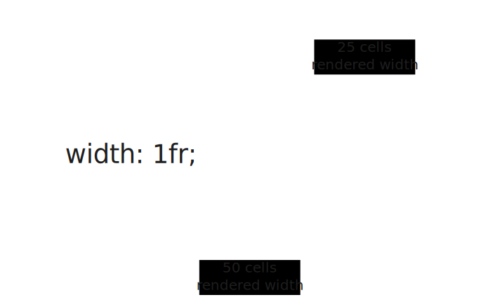
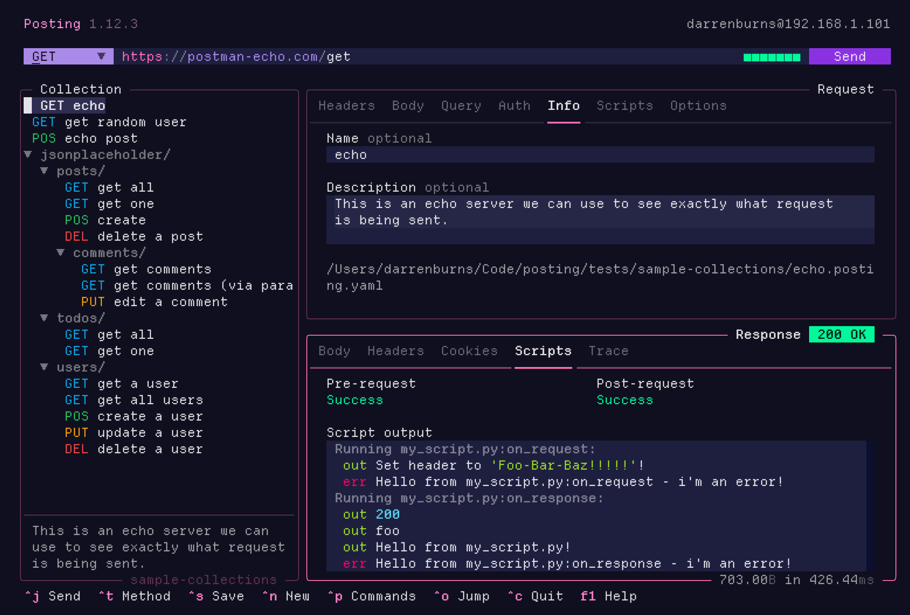
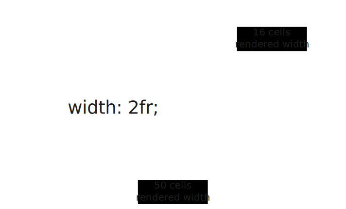
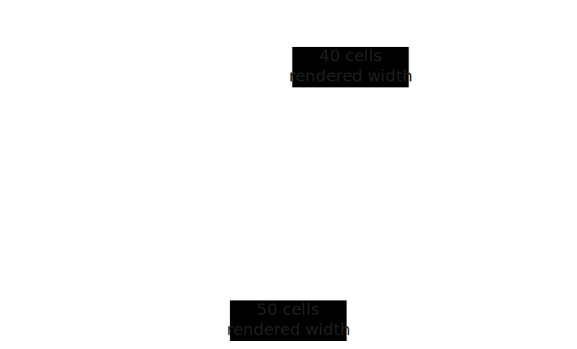

+++
title = "Let's get fractional"
date = 2024-10-01T22:22:47+01:00
draft = false
author = "Darren Burns"
tags = ['textual', 'python', 'layout']
+++

Fractional units (`fr`) are a tool in [Textual's CSS system](https://textual.textualize.io/guide/CSS/) which lets you divide up space inside a container in an intuitive way.

I use them *everywhere* in my Textual apps.
They provide an intuitive solution to many common layout patterns, and have some less obvious benefits too!

`width: 1fr;` is one of the most useful snippets of CSS to have in your toolkit.
This CSS can be thought of as "fill out the remaining available space" in the parent container.
By "remaining space" I'm referring to the space along an axis that hasn't been assigned a "concrete" value such as `width: 10;`.

Let's explore how fractional units work in Textual, along with some practical examples!

## Splitting a container in half

Consider the CSS below, which assigns a width of `1fr` to two widgets inside a `Horizontal` container:

```scss
Horizontal {
    width: 50;

    & > Left {
        width: 1fr;
    }
    
    & > Right {
        width: 1fr;
    }
}
```

Both `Left` and `Right` widgets have width `1fr`, meaning they'll be given equal space inside the `Horizontal` container (25 cells each in this case):



In my terminal-based HTTP client, [Posting](https://github.com/darrenburns/posting), I use `height: 1fr` to evenly split the request and response sections:



## Changing the distribution

If one of our child widgets, say, the `Left` one, is updated to `width: 2fr`, then that widget will take up *two thirds* of the space, and the other widget will take up the remaining one third.



This is because we've now assigned a total of 3 `fr` units along the horizontal axis.

- The `Left` widget was assigned 2 units on the horizontal axis, so receives 2/3 of the available space.
- The `Right` widget was assigned 1 unit, so receives 1/3 of the available space.

Also note that in this example, the parent `Horizontal` widget has a width of 50, which is *not* divisible by 3.
However, when using fractional units, Textual takes care of that for you, ensuring that the space is fully distributed with no remainder!

## Mixing concrete and fractional units

Fractional units also interact wonderfully with concrete values like `width: 10;`, and this combo has several practical use-cases.
For example, it lets us model a fixed-width "sidebar", and have the rest of the content fill out the remaining space. 



Having the blue "Content" widget in the example below fill out like it does is not possible using `%`, as the value we'd need to set it to would change if the parent container was resized.


## Other benefits

The `fr` unit also guarantees that we'll always use precisely 100% of the *remaining* space, while also handling rounding issues you might encounter when dealing in percentages... because 33.3% + 66.6% != 100%.

Finally, `fr` units are comparatively easy to maintain if you're looking to tweak the distribution of space. To change the distribution, you often only need to update the width of a single child, and the remaining `fr` unit children will adapt automatically to fill the width. With `%` units, you'd need to calculate the widths you want and ensure they sum to 100% (and even then, good luck with the inevitable rounding issues!).
