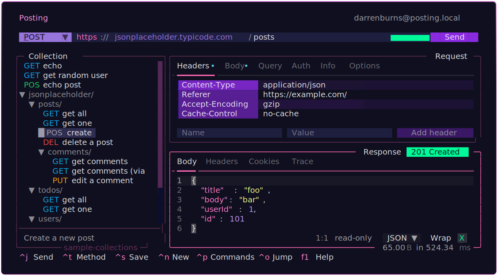
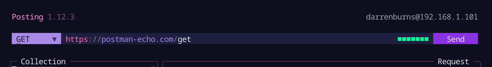

+++
title = "Let's get fractional - Textual layouts with fr units"
date = 2024-10-01T22:22:47+01:00
draft = false
author = "Darren Burns"
tags = ['textual', 'python', 'layout']
+++

Fractional units (`fr`) are a tool in [Textual's CSS system](https://textual.textualize.io/guide/CSS/) which lets you distribute space between child widgets inside a container in a really intuitive way.

I use them *everywhere* in my Textual apps, but I get the feeling that they may be a little under-appreciated.

`fr` units make it easy to implement many common layout patterns, and have some less obvious benefits too!

Let's explore how fractional units work in Textual, along with some practical examples!

## A half-and-half layout

Consider the CSS below, which assigns a width of `1fr` to two widgets inside a `Horizontal` container:

```scss
Horizontal {
    & > Left {
        width: 1fr;
    }
    
    & > Right {
        width: 1fr;
    }
}
```

Both `Left` and `Right` widgets have width `1fr` out of a total of 2 assigned units on the horizontal axis, meaning they'll be given `1/2` of the available space inside the `Horizontal` container (25 cells each in this case). `Horizontal` is a Textual utility container which itself has width `1fr`.


In my terminal-based HTTP client, [Posting](https://github.com/darrenburns/posting), I use `height: 1fr` to evenly split the request and response sections inside a `Vertical` container:



That's all well and good, but it's not really offering anything new over using `%` units, is it?

## Changing the distribution

If one of our child widgets, say, the `Left` one, is updated to `width: 2fr`, then that widget will take up *two thirds* of the space, and the other widget will take up the remaining one third.


This is because we've now assigned a total of 3 `fr` units along the horizontal axis.

- The `Left` widget was assigned 2 units on the horizontal axis, so receives 2/3 of the available space.
- The `Right` widget was assigned 1 unit, so receives 1/3 of the available space.

Note that in this example, the parent `Horizontal` widget has a width of 50, which is *not* divisible by 3. However, when using fractional units, Textual takes care of that for you, ensuring that the space is fully distributed with no remainder!

This also shows another subtle benefit - we only need to update a single value to `2fr` and the other children will automatically adjust to fill the remaining space. When using percentages, we'd need to update all children and ensure they sum to 100% to get (almost) the same effect.

## Mixing concrete and fractional units

Fractional units also interact wonderfully with concrete values like `width: 10;`, and this combo has several practical use-cases.
For example, it lets us model a fixed-width "sidebar", and have the rest of the content fill out the remaining space. 


The CSS for this might look something like this:

```scss
Horizontal {
    & > Sidebar {
        width: 10;
    }

    & > Content {
        width: 1fr;
    }
}
```

Having the blue `Content` widget in the example below fill out like it does is not possible using `%`, as the value we'd need to set it to would change if the parent container was resized.

We can again see this in action in Posting, this time in the URL bar:



The method selector dropdown on the left and the send button on the right have fixed widths, while the URL input has `width: 1fr`, allowing it to fill the space between them.

I've found this to be a recurring pattern in my apps: a `Horizontal` container with a few children having fixed or `auto`-calculated widths, with one (or sometimes more) children having `width: 1fr` to fill the remaining space.

Here's the Python code directly taken from Posting which shows this in practice:

```python
    def compose(self) -> ComposeResult:
        with Horizontal():
            yield MethodSelector(id="method-selector") # fixed width
            yield UrlInput(  # width: 1fr
                placeholder="Enter a URL...",
                id="url-input",
            )
            yield Label(id="trace-markers")  # fixed width
            yield SendRequestButton("Send")  # fixed width

```

## Other benefits

The `fr` unit also guarantees that we'll always use precisely 100% of the *remaining* space, while also handling rounding issues you might encounter when dealing in percentages... because 33.3% + 66.6% != 100%.

Finally, `fr` units are comparatively easy to maintain if you're looking to tweak the distribution of space. To change the distribution, you often only need to update the width of a single child, and the remaining `fr` unit children will adapt automatically to fill the width. With `%` units, you'd need to calculate the widths you want and ensure they sum to 100% (and even then, good luck with the inevitable rounding issues!).
