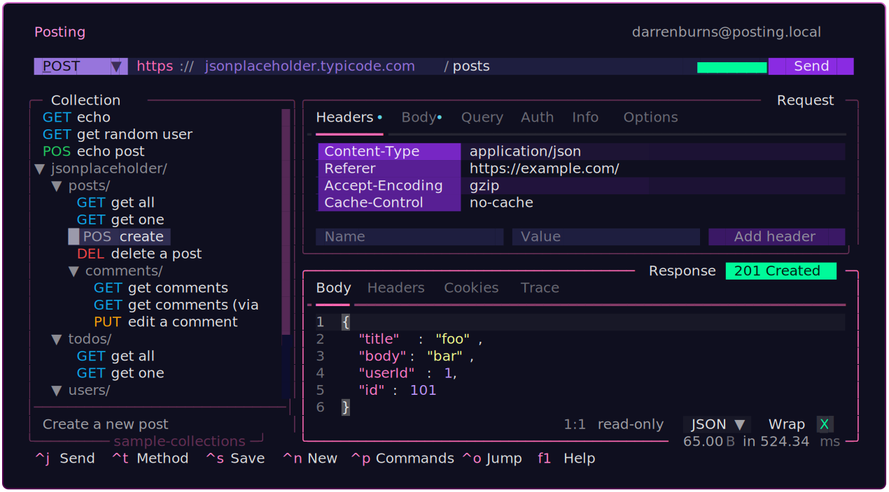
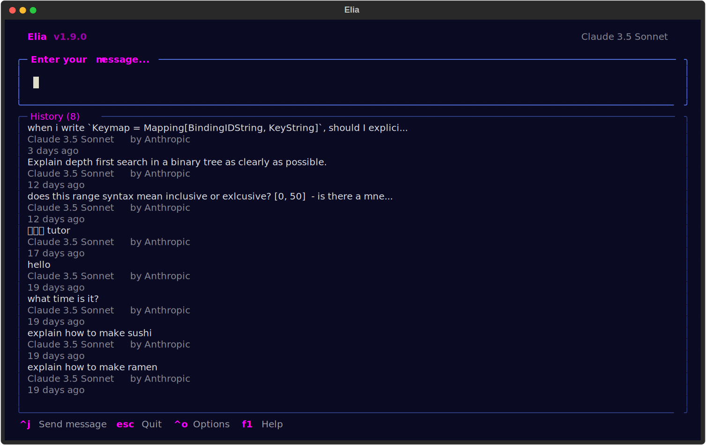
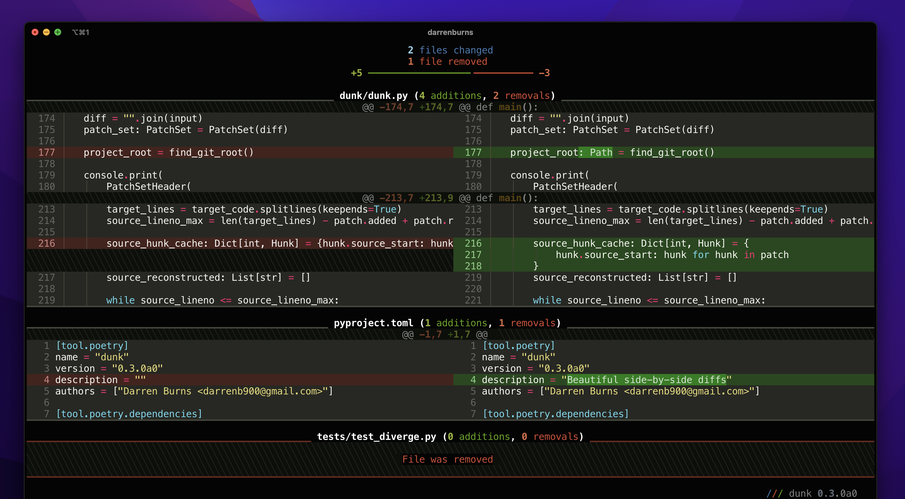
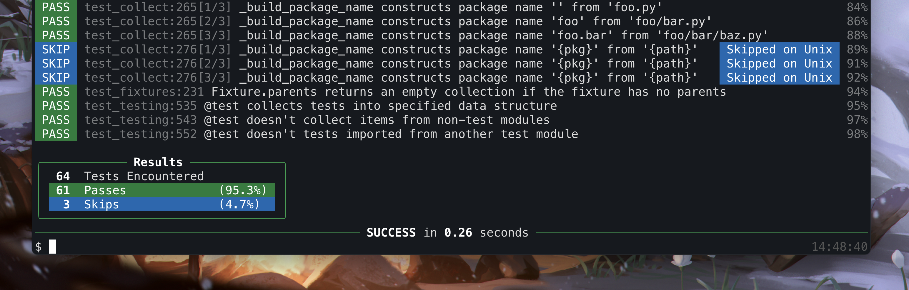
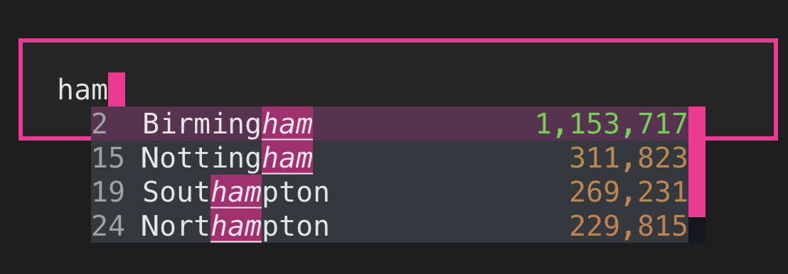
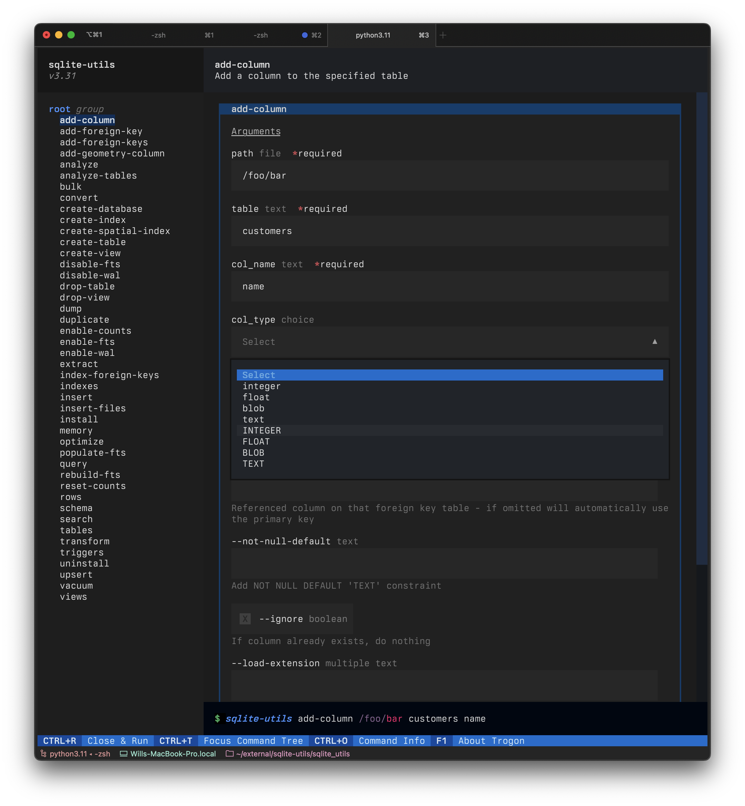

+++
title = "My projects"
draft = false
author = "Darren Burns"
+++

Over the years I've developed several open source projects.

The majority are written in Python, and they're typically terminal-based developer tools.

## Posting

[Posting](https://posting.sh) is a powerful TUI for working with HTTP APIs.
It's a bit like Postman, except it runs in the terminal and is designed around keyboard-centric workflows.

It's a feature-rich tool that tries to work for both terminal power-users and newcomers who are more accustomed to modern web UIs.

Written in Python using [Textual](https://textual.textualize.io/), a TUI framework I help develop and maintain.

## Elia

[Elia](https://github.com/darrenburns/elia) is a TUI for interacting with large language models.
It can interact with proprietary models such as Claude, ChatGPT, as well as local models like Llama.

## Dunk

[Dunk](https://github.com/darrenburns/dunk) makes your diffs beautiful and easy to read.
Just pipe your `git diff` output into Dunk and it'll generate a colourful diff like this:

## Textual's `TextArea` widget

I developed Textual's `TextArea` widget, which is a multi-line input widget that supports `tree-sitter` syntax highlighting, wrapping, undo/redo, full mouse support, and much more.

I wrote a blog post about it [here](https://textual.textualize.io/blog/2023/09/18/things-i-learned-while-building-textuals-textarea/), which includes a whole lot of videos of it in action, and covers some of my learnings from that project.

## Ward (archived)

[Ward](https://github.com/darrenburns/ward) was a test framework I developed for Python.
It had a strong focus on readability.
Test descriptions were written in plain language rather than function names,
and it output very readable diffs when tests failed.

## Autocomplete

I developed [textual-autocomplete](https://github.com/darrenburns/textual-autocomplete), which let's you add autocompletion to your Textual-based TUI apps.

I'm currently (slowly) working on the next version which will be used in [Posting](https://posting.sh).

## Trogon

[Trogon](https://github.com/Textualize/trogon) was built to solve the problem of learning and discovering features of CLIs.
In just a few lines of code it lets you create a fully interactive TUI which can be used in place of a CLI.
Here's an example of Trogon converting the feature-rich `sqlite-utils` CLI into a TUI:

## Radiant

I developed (but never released) an iOS and Android app using Flutter and the Dart programming language.



